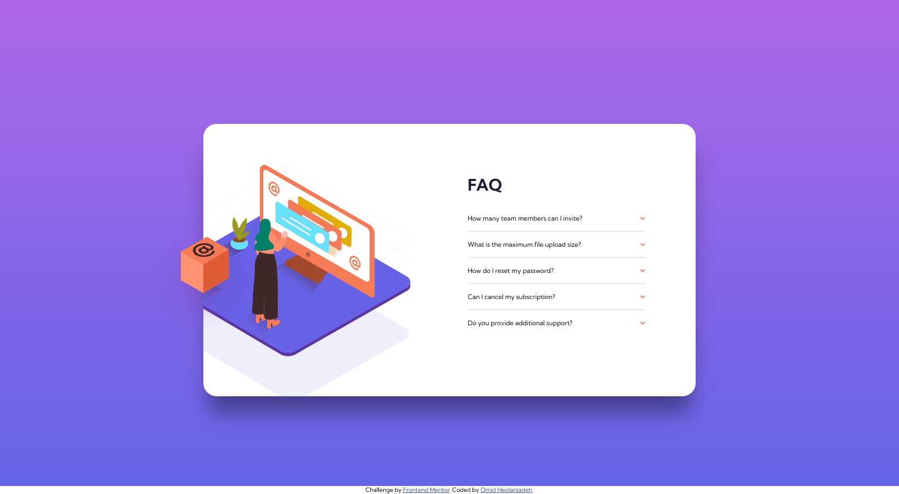

# Frontend Mentor - FAQ accordion card solution

This is a solution to the [FAQ accordion card challenge on Frontend Mentor](https://www.frontendmentor.io/challenges/faq-accordion-card-XlyjD0Oam). Frontend Mentor challenges help you improve your coding skills by building realistic projects.

## Table of contents

- [Overview](#overview)
  - [The challenge](#the-challenge)
  - [Screenshot](#screenshot)
  - [Links](#links)
- [My process](#my-process)
  - [Built with](#built-with)
  - [What I learned](#what-i-learned)
- [Author](#author)

## Overview

### The challenge

Users should be able to:

- View the optimal layout for the component depending on their device's screen size
- See hover states for all interactive elements on the page
- Hide/Show the answer to a question when the question is clicked

### Screenshot



### Links

- Solution URL: [FAQ-accordion-card](https://github.com/Omid-Heidarzadeh/FAQ-accordion-card/tree/main)
- Live Site URL: [live site](https://omid-heidarzadeh.github.io/FAQ-accordion-card/)

### Built with

- Semantic HTML5 markup
- SCSS
- Flexbox
- CSS Grid
- Mobile-first workflow
- Responsive Design
- [Autoprefixer](https://autoprefixer.github.io/) - Autoprefixer CSS online
- [HTML](https://validator.w3.org/) & [CSS](https://jigsaw.w3.org/css-validator/) validated using W3C validators

### What I learned

1- I decided to use `<details>` and `<summary>` HTML tags for structuring accordion, so at first I had to remove or hide the default browser triangle markers. The corresponding selector for this pseudo element is `::marker` but for some reason properties like `display`, `visibility`, `width` and `height` doesn't have any effect on it. Therefore, used `font-size: 0` and `color: transparent` as an alternative trick.

```CSS
::marker {
  font-size: 0;
  color: transparent;
}
```

2- I recently learned `SASS` and this is the first project that I have written its `CSS` code using `SCSS`.

3- In this project, the main challenge was "How to arrange items, images especially, alongside each other as is in the design images?" and also, "How to manipulate elements inside SVG graphics using class attribute and CSS?"

```html
<path
  class="image__box--mobile"
  fill="#DF5C34"
  fill-rule="nonzero"
  d="M70.984 93.896v26.935l23.694-14.013V79.883z"
/>
```

```css
@media screen and (min-width: 900px) {
  [class$="--mobile"] {
    display: none;
  }
}
```

4- I needed to complete the challenge without using Javascript as a bonus. Using `<details>` and `<summary>` tags was a good start to acheive this goal, but there was still a problem.

> How to change properties and appearance of child-elements according to current state of these two tags?

By inspecting these elements using browser I figured out that when the `<summary>` is opened, an `"open"` attribute is added to the `<details>` element. So I used CSS attribute selector like this:

```css
&[open] {
  color: $summary-text;
  font: {
    weight: 700;
    size: 1.3rem;
  }
  .shevron {
    transform: rotate(180deg);
  }
}
```

## Author

- Frontend Mentor - [@Omid-Heidarzadeh](https://www.frontendmentor.io/profile/Omid-Heidarzadeh)
- Linkedin - [Omid Heidarzadeh](https://www.linkedin.com/in/omid-heidarzadeh-112416146/)
